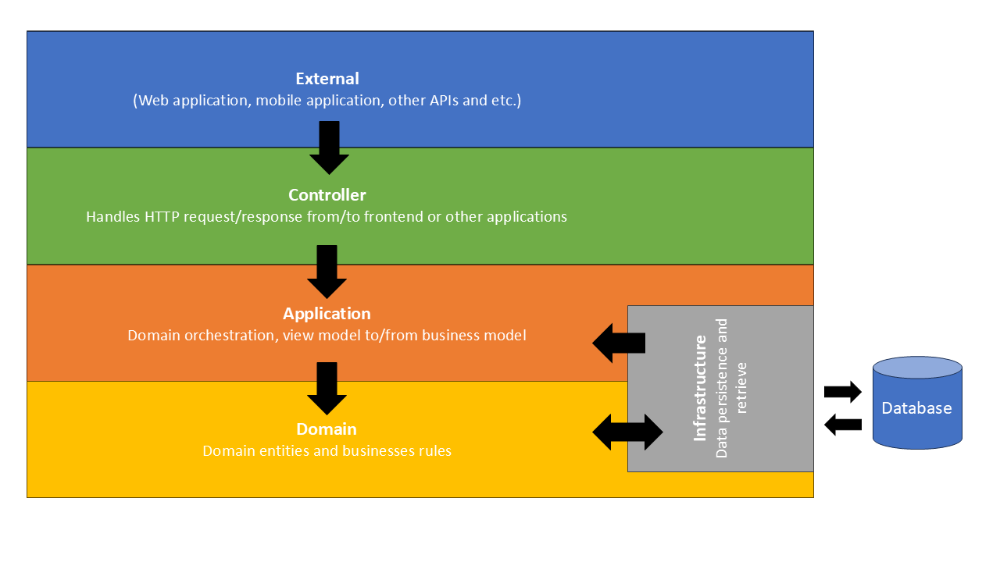

# CleanArchAcceleratorTools

A modular toolkit to accelerate building applications using Clean Architecture. This repository provides cohesive modules you can use individually or via an all-in-one package.

## Modules at a glance

- [CleanArchAcceleratorTools.AllInOne](./src/core/CleanArchAcceleratorTools.AllInOne)
  Single package that aggregates Domain, Application, Infrastructure, and Controller for projects that does not require separated projects.

- [CleanArchAcceleratorTools.Controller](./src/core/CleanArchAcceleratorTools.Controller)  
  Controller base classes for exposing endpoints, consistent request and response handling, global exception filter, and direct access to Application ViewModels and services.

- [CleanArchAcceleratorTools.Application](./src/core/CleanArchAcceleratorTools.Application)  
  Use case orchestration, ViewModels/DTOs, Unit of Work, and dependency-injected access to repositories and domain services. Provides pagination and dynamic query helpers at the application layer.

- [CleanArchAcceleratorTools.Domain](./src/core/CleanArchAcceleratorTools.Domain)  
  Core domain model and rules. Includes Entities, domain Services, validations (FluentValidation), domain events/notifications (mediator), and shared models for DynamicFilter/DynamicSort and pagination.

- [CleanArchAcceleratorTools.Infrastructure](./src/core/CleanArchAcceleratorTools.Infrastructure)  
  EF Core integrations and utilities: DynamicSelect, DynamicFiltering/DynamicSorting, pagination helpers, generic repository, entity mappings, parallel query execution, and dataTable creation for procedures/raw SQL.



## Key capabilities

- DynamicSelect for efficient projections (avoid over-fetching)
- Dynamic Filtering and Sorting with fluent builders
- Pagination helpers and result models
- Mediator for domain events/notifications
- Unit of Work and Generic Repository patterns
- Global exception handling for APIs
- Parallel query execution and DataTable helpers

## Compatibility

Multi-targeted:
- .NET 6
- .NET 7
- .NET 8
- .NET 9

Use an EF Core version compatible with the chosen target framework.

## Installation

Use the all-in-one when you don’t need module separation:

```bash
dotnet add package CleanArchAcceleratorTools.AllInOne --version x.x.x
```
Or install individual modules as needed:
```bash
dotnet add package CleanArchAcceleratorTools.Controller --version x.x.x
dotnet add package CleanArchAcceleratorTools.Application --version x.x.x
dotnet add package CleanArchAcceleratorTools.Domain --version x.x.x
dotnet add package CleanArchAcceleratorTools.Infrastructure --version x.x.x
```

## Example

See the example API showcasing all modules:
- [CleanArchAcceleratorTools.Examples](./src/examples/CleanArchAcceleratorTools.Examples)

## Contributing

Issues and PRs are welcome. See each module’s README for specifics and tips.